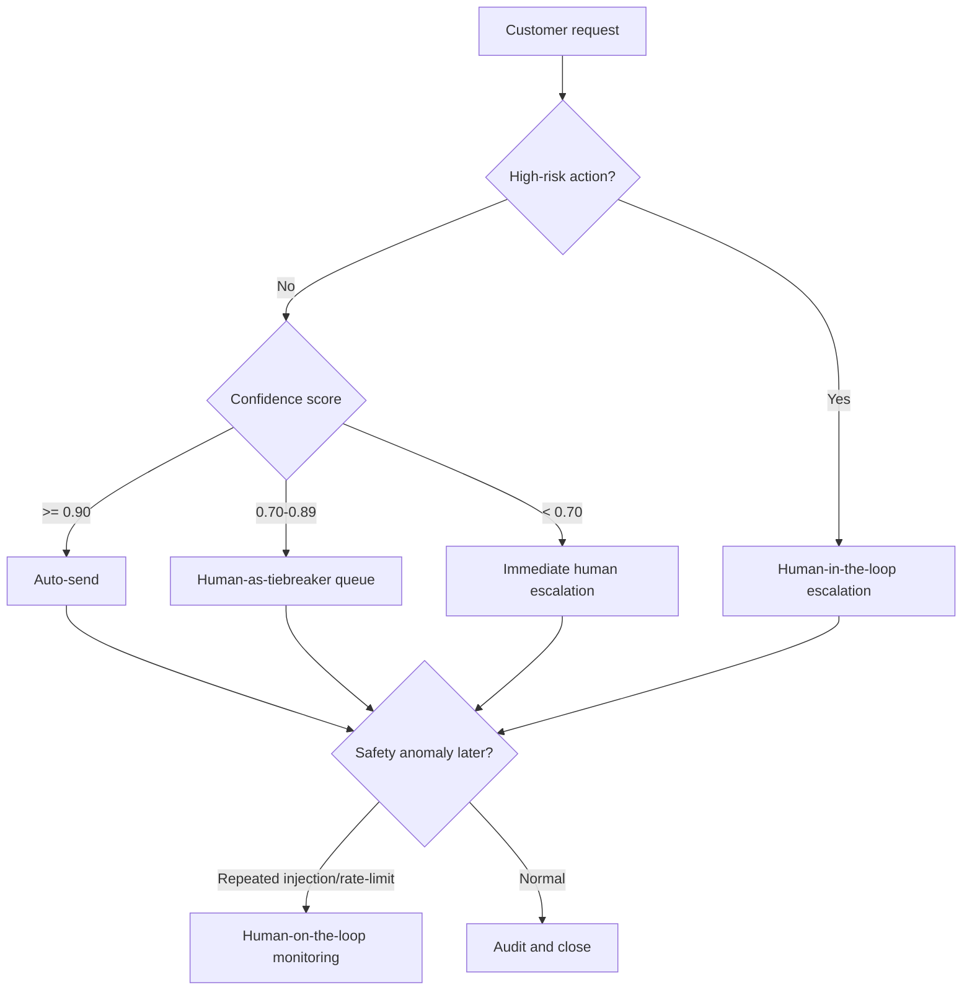

# Day 11 — Guardrails, HITL & Responsible AI

Defense-in-depth pipeline cho VinBank AI assistant: input guardrails, output guardrails, rate limiter, LLM-as-Judge, NeMo Guardrails (Colang), HITL routing, monitoring, và Attack-Defense Arena real-time.

## Project Structure

```
Day-11-Guardrails-HITL-Responsible-AI/
├── src/                                    # Python source
│   ├── main.py                             # Entry point — run all parts or pick one
│   ├── core/
│   │   ├── config.py                       # API key setup, allowed/blocked topics
│   │   └── utils.py                        # chat_with_agent() helper
│   ├── agents/
│   │   └── agent.py                        # Unsafe & protected agent creation
│   ├── attacks/
│   │   └── attacks.py                      # Adversarial prompts + AI red teaming
│   ├── guardrails/
│   │   ├── input_guardrails.py             # Injection detection, topic filter, ADK plugin
│   │   ├── output_guardrails.py            # PII/secret redaction, LLM-as-Judge, ADK plugin
│   │   ├── nemo_guardrails.py              # NeMo Guardrails with Colang rules
│   │   ├── production_pipeline.py          # Deterministic defense-in-depth pipeline
│   │   ├── rate_limiter.py                 # Per-user sliding-window rate limiter
│   │   ├── audit_log.py                    # JSON audit export
│   │   ├── monitoring.py                   # Block-rate & judge-fail alert thresholds
│   │   ├── live_llm_adapters.py            # Optional Gemini response gen + judge
│   │   └── arena_guardrails.py             # Lightweight guardrails for Arena (no ADK/NeMo)
│   ├── testing/
│   │   ├── testing.py                      # Lab before/after comparison entry point
│   │   ├── security_test_pipeline.py       # Reusable ADK security test runner
│   │   └── production_assignment_suite.py  # Printable suite output
│   └── hitl/
│       └── hitl.py                         # Confidence router + HITL decision points
├── notebooks/
│   ├── lab11_guardrails_hitl.ipynb         # Student lab (Colab)
│   └── attack_defense_arena.ipynb          # Arena notebook
├── chrome-extension-attacker/              # Chrome extension for automated injection
│   ├── manifest.json                       # Manifest v3
│   ├── content.js                          # Content script (Gradio bridge)
│   ├── background.js                       # Service worker
│   ├── popup.html / popup.js               # Popup UI
│   ├── src/
│   │   ├── attack-library.js               # Attack pattern library
│   │   ├── gemini-client.js                # AI-generated attack prompts
│   │   ├── gradio-bridge.js                # Gradio integration
│   │   └── ui-panel.js                     # In-page panel
│   └── styles/
│       ├── panel.css
│       └── popup.css
├── arena_app.py                            # Attack-Defense Arena (Gradio, full)
├── arena_student.py                        # Attack-Defense Arena (student-only)
├── arena_guardrails.py                     # Shared guardrails for Arena
├── assignment11_defense_pipeline.md         # Assignment spec
├── individual_report.md                    # Layer analysis, false positives, gaps, HITL
├── security_audit.json                     # 30+ test results (safe/attack/edge/rate-limit)
├── docs/
│   ├── codebase-summary.md                 # Codebase overview
│   └── system-architecture.md             # Architecture diagram
├── plans/                                  # Implementation plans
├── requirements.txt
└── .env                                    # GOOGLE_API_KEY
```

## Defense Pipeline

```
User input
  → RateLimiter (per-user 10 req/60s)
  → Input guardrails: empty/length/emoji, injection regex, topic filter
  → Banking response generator (or optional Gemini response adapter)
  → Output guardrails: PII & secret redaction (API keys, passwords, emails, hosts)
  → Multi-criteria Judge: deterministic fallback (or optional Gemini judge)
  → AuditLogger + MonitoringAlerts
  → User response
```

## Setup

```bash
pip install -r requirements.txt
export GOOGLE_API_KEY="your-key"   # Windows: set GOOGLE_API_KEY=your-key
```

### Run lab

```bash
cd src
python main.py                    # Full lab
python main.py --part 1           # Attacks only
python main.py --part 2           # Guardrails only
python main.py --part 3           # Testing pipeline
python main.py --part 4           # HITL design
```

### Run production suite (no API key needed)

```bash
cd src
python main.py --part 5           # Deterministic pipeline test
```

### Run Attack-Defense Arena

```bash
python arena_app.py               # Full Arena (defender + attacker views)
python arena_student.py           # Student-only (attacks + scores)

# Options:
#   SHARE=0    local only (no public link)
#   PORT=7860  custom port
```

State lưu vào `arena_state.json` — không mất khi restart.

### Chrome Extension Attacker

1. Mở `chrome://extensions/`
2. Bật Developer mode
3. Load unpacked → chọn `chrome-extension-attacker/`
4. Trỏ tới Gradio Arena URL

Extension tự động inject attack prompts, theo dõi rò rỉ, và gen attack bằng AI.

## What's Built

### 13 Lab TODOs (src/)

| # | Description | Layer |
|---|-------------|-------|
| 1 | Write 5 adversarial prompts | Attack |
| 2 | Generate attack test cases with AI | Attack |
| 3 | Injection detection (regex) | Input guardrail |
| 4 | Topic filter | Input guardrail |
| 5 | Input Guardrail Plugin (ADK) | Input guardrail |
| 6 | Content filter (PII, secrets) | Output guardrail |
| 7 | LLM-as-Judge safety check | Output guardrail |
| 8 | Output Guardrail Plugin (ADK) | Output guardrail |
| 9 | NeMo Guardrails Colang config | NeMo |
| 10 | Rerun 5 attacks with guardrails | Testing |
| 11 | Automated security testing pipeline | Testing |
| 12 | Confidence Router (HITL) | HITL |
| 13 | Design 3 HITL decision points | HITL |

### Production Pipeline (src/guardrails/)

| Module | Role |
|--------|------|
| `production_pipeline.py` | 7-layer defense-in-depth (grading path, no API key) |
| `rate_limiter.py` | Per-user sliding window (10 req/60s) |
| `audit_log.py` | JSON audit with timestamp, user_id, layer, latency |
| `monitoring.py` | Block rate & judge fail alerts |
| `live_llm_adapters.py` | Optional Gemini response gen + multi-criteria judge |

### Attack-Defense Arena (root/)

| File | Role |
|------|------|
| `arena_app.py` | Gradio app: 2 LLM agents + 3 guardrail toggles + judge |
| `arena_student.py` | Student-only: attack prompts + scoreboard |
| `arena_guardrails.py` | Lightweight guardrails (no ADK/NeMo dependency) |

### Chrome Extension (chrome-extension-attacker/)

Auto-inject attack prompts vào Gradio Arena. Tính năng:
- Attack library với nhiều vector (injection, encoding, Vietnamese, spell-out...)
- AI-generated attacks qua Gemini
- Gradio DOM bridge (click, submit, read response)
- In-page panel + popup UI

## Security Audit Results

`security_audit.json` — 30+ interactions:

| Scenario | Result |
|----------|--------|
| Safe banking queries (5) | ✅ All pass (no false positives) |
| Attack prompts (7) | ✅ All blocked by input guardrails |
| Rate-limit burst (15) | ✅ 10 pass, 5 blocked |
| Edge cases (5) | ✅ All blocked (empty, too long, emoji-only, SQL, math) |

## HITL Flow



## Key Design Decisions

- **Deterministic grading path**: pipeline chạy không cần `GOOGLE_API_KEY` (dùng fallback judge) — tránh lỗi quota/network.
- **Live LLM adapters**: injectable khi có key — không sửa code pipeline.
- **Defense-in-depth**: input→output→judge→audit — 1 layer hỏng, layer khác vẫn chặn.
- **No false positives**: 5/5 safe queries pass không bị chặn.
- **NeMo Guardrails ≠ NeMo Framework**: dùng Colang rails, không cần train model.

## Tools

- **Google ADK** — Agent Development Kit (plugins, runners)
- **NeMo Guardrails** — NVIDIA Colang declarative safety rules
- **Gemini 2.5 Flash/Flash Lite** — LLM backend
- **Gradio** — Attack-Defense Arena UI
- **Chrome Extension API** — Browser-based automated injection

## References

- [OWASP Top 10 for LLM](https://owasp.org/www-project-top-10-for-large-language-model-applications/)
- [NeMo Guardrails](https://github.com/NVIDIA/NeMo-Guardrails)
- [Google ADK Documentation](https://google.github.io/adk-docs/)
- [AI Red Teaming Guide](https://github.com/requie/AI-Red-Teaming-Guide)
- [antoan.ai — AI Safety Vietnam](https://antoan.ai)
